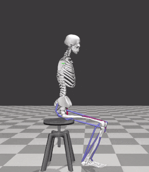

# Sit-to-Stand Motion Synthesis

## Overview
Sit-to-stand (STS) is the most biomechanically challenging task necessary for performing activities of daily life.
Many physiological and psychological factors, with muscle strength being the most dominant, affect the way an individual performs STS transition.
Presence of many co-occuring factors makes it complex to establish cause effect relationships using experiments.
We use this code to predict the effects of muscle weakness on STS, and to generate assistance trajectories in cases when the muscle weakness was too large to accomplish unassisted STS. 
The muscle weakness is introduced by scaling the maximum isometric strength's of the Hill Type Muscles.
The assistance is provided at the torso's center of mass.

We generate Assisted/Unassisted STS trajectories by tuning the open-loop excitation trajectories of muscles and external assistance using single shooting optimization.
Active Covariance Matrix Adaptation Evolution Strategy (aCMAES) is used for optimization.
Sitting muscle excitation trajectories, which are also generated using the same framework, are used as intial guesses for Assisted/UnAssisted Sit-to-Stand optimizations.
For more information on the cost functions used to generate these motions please refer to the code or docs.

## Building Details
1. Set up the *Standing* and *Assisted* flags, simulation duration and other hyper-parameters in the universalConsts.h file.
2. Use the CMakeLists to build either the *main.cpp* or *replay.cpp*. *main.cpp* contains the optimization code for generating Assisted/Unassisted Sit-to-Stand or Sitting trajectory.
3. Edit the hyperparams___.txt 
4. Run the *./main initialGuessFileName.txt hyperParamsFileName.txt resumeDir(null/dir)* or *./replay #nNodesPerActuators(17) fileName.txt genStart genEnd visualize(true/false) logResults(true/false)* commands. file naming convention

- The main file outputs logs in build/results/FolderName/ directory
- For resuming the optimization the directory path containing the log files should be passed to the Main file 
- Replay file can be used with the logBest.txt or logMean.txt files for visualization

### Dependencies:
1. libcmaes (https://github.com/CMA-ES/libcmaes/tree/2c2f56068c562a3967fe7ccb4b42e48dd1d7be83)
2. opensim-core (https://github.com/opensim-org/opensim-core/tree/49233a6230b96a70a4142a875ea0ed23ecd6032f) 

## File Naming Convention
- **"Assisted/UnAssisted"** is used within the file names to indicate whether it is supposed to work or not with external assistance.
- **"_\*\*pct"** percetage maximum isometric strength deficit. *0%* corresponds to the maximum isometric strength of healthy adult